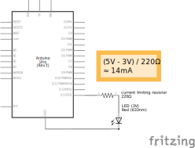

# 01_led_blink

The program has a serial output on LED `ON`/`OFF` which can be inspected using the *Serial Monitor* (`Ctrl` + `Shift` + `M`).

The LED is optional since the Arduino UNO R3 board already has a LED on the board that will also blink at the same time.

Since this LED is already connected to this PIN the current is per default limited by a resistor which means a LED can be safely connected.

## Alternative designs

An LED can also be connected to the pin without altering the program.

> [!NOTE]
>
> LEDs and the GPIO pins of the Arduino are both sensitive to high current:
>
> - The Arduinos GPIO pins have a maximum current limit of $40 \text{m}A$ ($0.04 A$) and should generally be operated at $20 \text{m}A$ ($0.02 A$)
> - Most standard LEDs have a maximum current rating of around $20 \text{m}A$ ($0.02 A$)
>
> When an LED is forward-biased (connected with correct polarity to a power source), it has a specific forward voltage drop.
> This is the voltage needed for the LED to start conducting current and producing light:
>
> - Red LEDs: $\approx 1.8 V$ to $2.2 V$
> - Green LEDs: $\approx 2.0 V$ to $3.5 V$
> - Blue and White LEDs: $\approx 3.0 V$ to $3.5 V$
>
> Using Ohm's law we can create the following equation:
>
> $$
> \begin{align*}
> \overset{\text{Stromstärke}}{I} &= \dfrac{\overset{\text{Spannung}}{U}}{\overset{\text{Wiederstand}}{R}}
>                                  = \dfrac{\overset{\text{Arduino GPIO pin voltage}}{5V} - \overset{\text{LED forward voltage drop}}{2V}}{R} \\
> \end{align*}
> $$
>
> Inserting into this a really small resistance (e.g. none) creates a really big current that is outside of the recommended limit/rating of both the Arduino GPIO pin and the standard LED.
>
> When we insert a standard $220 \Omega$ resistor the resulting current of $14 \text{m}A$ is below the recommended limit/rating of both the Arduino GPIO pin and the standard LED thus protecting the LED, the microcontroller and preventing excessive power draw.
>
> $$
> \begin{align*}
> \overset{\text{Stromstärke}}{I} &= \dfrac{3V}{220 \Omega} \approx 0.01\overline{36} A \approx 14 \text{m}A
> \end{align*}
> $$

