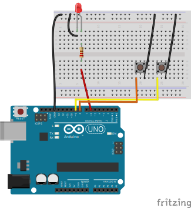
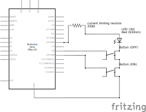

# 02_led_button

The LED can be turned off and on again by reading button presses using digital inputs.





> [!NOTE]
>
> To measure if a button is pressed a (integrated) pull-up resistor is utilized.
> This means that internally the pin is providing a voltage of $5V$ with a resistor of e.g. $10 \text{k}\Omega$
> While each of the connected buttons are not pressed their pull-up resistors connect each input pin to a `HIGH` state.
> When one of the buttons is pressed, it creates a direct connection between their input pin and ground (`GND`) resulting in a `LOW` state.
> If no resistor would be provided (e.g. $5V$ - sens pin - button - `GND`) clicking the button would short circuit the board since this is a direct connection between $5V$ and `GND` with no resistance between each other.
>
> ```cpp
> constexpr int BUTTON_PIN = 2;
>
> void setup() {
>   pinMode(BUTTON_PIN, INPUT_PULLUP);
> }
>
> void loop() {
>   if (digitalRead(BUTTON_PIN) == LOW) {
>     // button pressed
>   } else {
>     // button not pressed
>   }
>   // button debounce delay to avoid erratic changes
>   delay(100);
> }
> ```
