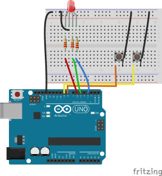

# 03_led_button_rgb

The RGB LED cycles through it's colors but can be turned off (and stopped) using a `OFF` button.
When the other button is pressed the LEDs turn `ON` again and resume the color cycle.




> [!NOTE]
>
> Each LED (Red, Green, Blue) is controlled using PWM (Pulse-width modulation).
> Approximately every $\frac{1}{500}s$ a PWM defined output sends a pulse.
> The length of this pulse is determined by the `analogWrite(LED_PIN, VALUE)` function.
> Using this function with an LED makes it able to determine the brightness of it by supplying $0$ for no brightness up to $255$ for maximum brightness.
>
> ```cpp
> constexpr int LED_PIN_RED = 6;
>
> void setup() {
>     pinMode(LED_PIN_RED, OUTPUT);
> }
>
> int val = 0;
>
> void loop() {
>     analogWrite(LED_PIN_RED, val);
>     val++;
>     if (val > 255) {
>         val = 0;
>     }
>     delay(10);
> }
> ```
