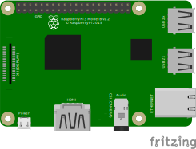

# Raspberry Pi 3B

These are instructions on how to setup the Raspberry Pi 3B to function like a Arduino (e.g. upload a program, start program at boot).




## Save broken/malfunctioning microSD Card

1. Try to format it using `gnome-disk-utility`, benchmark to check for errors
2. If errors persist use `lsblk`
   1. Run `lsblk` to see a list of all drives
   2. Run `sudo fdisk -l /dev/sd[INSERT_DRIVE]` to see drive information (e.g. `/dev/sdc`)
   3. Run `sudo fsck /dev/sd[INSERT_DRIVE]` to fix problems in the partition (e.g. `/dev/sdc1`)
   4. Go to step 1 and benchmark the drive to check for errors

## Setup

1. Install [`rpi-imager` (v1.9.0)](https://github.com/raspberrypi/rpi-imager)
2. Connect a microSD Card, format it with no partitions (e.g. `gnome-disk-utility`)
3. Start `rpi-imager` and select the formatted microSD Card and *Raspberry Pi OS (64-Bit)*
   1. Set user name and password (e.g. `pi` as user name)
   2. Add Wifi network name and password
   3. Set hostname (e.g. `raspberrypi2024.local` for easy SSH access)
   4. Enable SSH using password
4. Plug the microSD Card into the Raspberry Pi 3B and connect it to a power supply (if no WLan connection exists connect it to your router using the Raspberry Pi Ethernet port)
5. Connect to the Raspberry Pi via SSH (**be aware that the Raspberry Pi needs a minute to power up and connect the network/WLan before you can connect to it!**)
   1. Hostname:
      1. When a custom hostname was set in the `rpi-imager` step running `ssh [username]@[hostname].local` will connect to the Raspberry Pi without knowing it's IP address (e.g. `ssh pi@raspberrypi2024.local`)
   2. IP address:
      1. Run `hostname -I` on the Raspberry Pi or check your router to determine the IP address of it (e.g. `192.168.2.157`)
      2. Then run `ssh [username]@[IP address]` on your computer to connect to it using the previously set password (e.g. `ssh pi@192.168.2.157`)
6. Update Raspberry Pi
   1. Update Raspberry Pi software using: `sudo raspi-config`, then select *Update*
   2. Update installed software using: `sudo apt update && sudo apt full-upgrade`
   3. Automatically remove dependencies that are no longer required: `sudo apt autoremove`
7. SFTP (file system) connection to easily transfer and edit files without using the command line
   1. Dolphin:
      1. Click *Network* on the side bar, then click *Add Network Folder* on the top right
      2. Select *SFTP*
      3. Enter a custom name, the Raspberry Pi user name (e.g. `pi`), the Raspberry Pi network name [IP Address or Hostname] (e.g. `raspberrypi2024.local`) and a entry directory like the user home directory `/home/[username]/` (e.g. `/home/pi/`)
      4. Enter the SSH password to get remote access to all files in the Raspberry Pi home directory

### Enable/Disable SPI/I2C

```sh
sudo raspi-config
```

Select *Interface Options*, select *SPI*/*I2C*, enable/disable

## Create a service that is automatically (re)starting (`systemd`)

1. Create a script:

   ```sh
   # Install systemd python dependency to write logs to the journal
   sudo apt install python3-systemd
   ```

   ```sh
   nano $HOME/example_script.py
   ```

   ```py
   # Check if service is running as expected
   # (also write logs to journal - requires 'python3-systemd')
   import logging
   import time
   from datetime import datetime
   from systemd import journal

   logger = logging.getLogger("example_logger")

   logger.setLevel(logging.INFO)
   logger.addHandler(journal.JournalHandler(SYSLOG_IDENTIFIER='example_unit_name'))

   file_handler = logging.FileHandler('example_log_file.log')
   # Add timestamp to file logger
   formatter = logging.Formatter('%(asctime)s - %(levelname)s - %(message)s')
   file_handler.setFormatter(formatter)
   logger.addHandler(file_handler)

   interval_s = 10

   if __name__ == "__main__":
       logger.info("> service started")
       while True:
           logger.info("service is running")
           time.sleep(interval_s)
   ```

   Test it using:

   ```sh
   # Run the script
   python $HOME/example_script.py
   # Get the logs created by the script
   cat example_log_file.log
   # Get the logs created by the script from the journal
   journalctl SYSLOG_IDENTIFIER=example_unit_name
   # > Realtime logs
   journalctl SYSLOG_IDENTIFIER=example_unit_name -f
   # > Get logs during a specific time period (e.g. last 30s)
   journalctl SYSLOG_IDENTIFIER=example_unit_name --since "30s ago"
   ```

2. Create a `systemd` config directory:

   ```sh
   mkdir -p $HOME/.config/systemd/user
   ```

3. Create a `systemd` service inside that config directory:

   ```sh
   nano $HOME/.config/systemd/user/example_service.service
   ```

   ```ini
   [Unit]
   Description=Example service
   After=default.target

   [Service]
   ExecStart=/usr/bin/python3 /home/[username]/example_script.py
   WorkingDirectory=/home/[username]/
   StandardOutput=journal
   StandardError=journal
   Restart=always

   [Install]
   WantedBy=default.target
   ```

   **Replace `[username]` with your user name!** (e.g. `pi`)

   If the process is killed/exits `systemd` will instantly restart it

4. Enable the `systemd` service:

   ```sh
   # Make the systemd user manager aware of the new service
   systemctl --user daemon-reload
   # Enable the service to start on login
   systemctl --user enable example_service.service
   ```

   To test the service immediately run:

   ```sh
   systemctl --user start example_service.service
   ```

   To check the service status run:

   ```sh
   systemctl --user status example_service.service
   ```

   To test if it automatically starts reboot (`sudo reboot`) and wait a minute to reconnect via SSH, then check the content of the log file (`cat $HOME/example_log.txt`).

5. Stop/Remove/... the `systemd` service:

   ```sh
   # Stop service
   systemctl stop example_service.service
   ```

   ```sh
   # Disable the service from starting at boot
   systemctl disable example_service.service
   ```

   Forget the service:

   ```sh
   # Remove the service file
   rm $HOME/.config/systemd/user/example_service.service
   # Make the systemd user manager aware of the service removal
   systemctl --user daemon-reload
   # THIS WILL NOT STOP THE RUNNING SERVICE UNTIL REBOOTING
   # A MANUAL STOP IS STILL NECESSARY
   ```

> [!IMPORTANT]
>
> Per default the Raspberry Pi will start with the user logged in.
> Even though this is just a user service this means it will still start at boot.
>
> If that is not the case it is possible with the following command to make **ALL** user services of the current user start at boot without a user login:
>
> ```sh
> sudo loginctl enable-linger $(whoami)
> ```

## Split terminal

```sh
sudo apt-get install tmux
tmux
# Split
Horizontally: Press Ctrl-b followed by %
Vertically: Press Ctrl-b followed by "
```

- To horizontally split the terminal: `Ctrl`+`b` followed by `%`
- To vertically split the terminal: `Ctrl`+`b` followed by `"`
- To switch between panes: `Ctrl`+`b` followed by the left, right, up or down arrow key
- To close tmux: `Ctrl`+`b` followed by `d`

## TODO

- [ ] Fix trash-notifier breadboard
